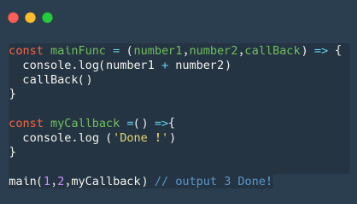
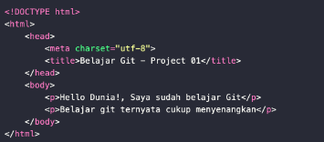
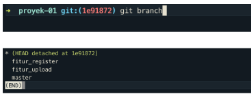
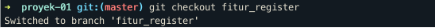
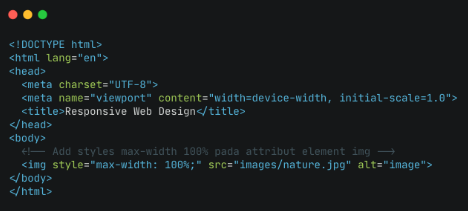
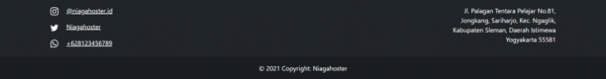

# __Wriring Test Week 3__
## __Javascript - Asynchronous__
### __Introduction__

- Javascript adalah bahasa pemrograman single-thread yang artinya hanya dapat mengeksekusi satu task pada satu waktu atau biasa disebut synchronous.

- Pada konsep pemrograman (web development pada case kita) dikenal istilah Asynchronous.

- Asynchronous mengizinkan komputer memproses task yang lain sambil menunggu proses yang masih berlangsung.

- membuat asynchronous secara simulasi artinya tidak murni asynchronous dengan beberapa cara:
    - Callback
    - Promises
    - Async/Await

### __Callback__

- Callback function adalah function yang kita letakan di dalam argumen/parameter pada function, dan function tersebut akan dieksekusi setelah function pertama menyelesaikan tugasnya.

    

- Proses asynchronous identik dengan delay, dimana hasil dari proses tersebut membutuhkan selang waktu tertentu untuk menghasilkan output. 

    Kita akan menemukan proses asynchronous pada proses Ajax, komunikasi HTTP, Operasi file, timer, dsb

    

    Ini adalah synchronous yaitu program dijalankan sesuai urutan code

    

    Pada asynchronous kita menggunakan setTimeOut untuk simulasinya. Proses function pada p2 kita lewati sambil menunggu selesai, program lanjut ke function p3

- setTimeout digunakan untuk simulasi asynchronous. Karena sebenarnya kita tidak bisa membuat proses asynchronous murni.

### __Promises__

- Promises adalah objek yang mungkin menghasilkan satu nilai di masa mendatang: baik nilai yang disukai, atau alasan mengapa hal itu tidak diselesaikan. 

- Promise adalah salah satu fitur baru di ES6, biasa digunakan untuk melakukan http request/fetch data dari API.

- Dalam pengambilan data, promise memiliki 3 kemungkinan state.
    - Pending(sedang dalam proses)
    - Fulfilled (berhasil)
    - Rejected (gagal)

    

### __Async-Await__

- Async - await adalah salah satu fitur baru dari javascript yang digunakan untuk menangani hasil dari sebuah Promise.

- Sedangkan await berfungsi untuk menunda sebuah kode dijalankan sampai proses asynchronous berhasil.

    

    Cara penulisan Async/await menggunakan es6 dan tidak menggunakan es6.

### __HTTP Request fetch()__

- Fetch adalah native web API untuk melakukan HTTP calls dari external network.

    

    fetch() memiliki parameter utama yaitu URL/endpoint API, dan parameter kedua yaitu options, options ini berisi method, headers dan body. Tergantung keinginan kita.

    

    Contoh function untuk mengambil data dari API menggunakan fetch(), Promise based

    

    Contoh function untuk mengambil data dari API menggunakan fetch(), Dengan Async Await..

<hr>

## __Git & GitHub Lanjutan__
### __Git Introduction__

- GIT adalah Tools untuk programmer

- GIT sebagai Version Control System yang tugasnya adalah mencatat setiap perubahan pada File (termasuk code yang kita buat) pada suatu proyek baik dikerjakan secara individu maupun tim.

- Git adalah aplikasi yang dapat melacak setiap perubahan yang terjadi pada suatu folder atau file.

- Git biasanya digunakan oleh para programmer sebagai tempat penyimpanan file pemrograman mereka, karena lebih efektif.

- File -file yg disimpan menggunakan git akan terlacak seluruh perubahannya, termasuk siapa yang mengubah.

- Dengan menggunakan GIT dan Github, kamu akan bisa bekerja dalam sebuat tim. Tujuan besarnya adalah kamu bisa berkolaborasi mengerjakan proyek yang sama tanpa harus repot copy paste folder aplikasi yang terupdate.

    Kamu juga tidak perlu menunggu rekan dalam satu tim kamu menyelesaikan suatu program dahulu untuk berkolaborasi. Kamu bisa membuat file didalam projek yang sama atau membuat code di file yang sama dan menyatukannya saat sudah selesai.

### __Instalasi GIT__

- Download dan jalankan hasil download GIT kamu seperti instal aplikasi pada umumnya

- Setup Awal

    

- Cek apakah instalasi berhasil

    

- Cek apakah setup berhasil

    

- email yang disetup HARUS SAMA dengan yang digunakan pada GITHUB

### __Repository GIT__

- Repository adalah direktori proyek yang kita buat.

    1 Repo =  1 Proyek = 1 Direktori

- Membuat Repository

    

- Command line tadi akan membuat sebuah direktori baru

- jika folder sudah ada sebelumnya?

    kamu bisa gunakan  ini:

    

### __GIT STATUS, GIT ADD, GIT COMMIT__

- Buat 2-3 file code pada direktori yang telah dibuat

1. GIT STATUS

    

- 3 Kondisi File pada GIT

    

- Modified adalah kondisi dimana revisi atau perubahan sudah dilakukan, tetapi belum ditandai (untracked) dan belum disimpan dalam version control.

- Staged adalah kondisi dimana revisi sudah ditandai (modified) namun belum disimpan di version control.

- Commit/committed adalah kondisi dimana revisi sudah disimpan pada version control.

2. GIT ADD

    Setelah cek status dengan ‘git status’, selanjutnya kita ubah status ‘untrackted file’ dan ‘unmodified’ menjadi modified

    Gunakan git add

    

    Atau

     

     

- Jika untracked file nya dalam jumlah besar?

    bisa menggunakan perintah ini:
    ```
    git add .
    ```

3.  GIT COMMIT

- Lakukan ‘git commit’ untuk save perubahan pada version control
    ```
    git commit -m "Commit Pertama"
    ```

    

### __Revisi Kedua pada GIT__

- Kondisi sudah tidak di ‘untrackted files’ tapi ‘modified files’

    


### __GIT LOG__

- Kedua revisi ini kita anggap sebagai checkpoint. 

    Jika nanti ada kesalahan, kita bisa kembali pada checkpoint ini.

    

- GIT LOG

    Dari dua revisi yang sudah dilakukan kita dapat melihat catatal log dari revisi - revisi tersebut dengan menggunakan perintah berikut ini:
    ```
    git log
    ```

    

- Untuk git log yang lebih pendek, bisa menggunakan perintah berikut ini:
    ```
    git log --oneline
    ```

    

- Melihat log dari berbagai sisi.
    - Melihat log menggunakan nomor version/commit

    - Melihat log file tertentu

    - Melihat log berdasarkan author

- Melihat log dari nomor version

    

- Melihat log dari file tertentu

    

- Melihat log berdasarkan author

    

### __GIT CHECKOUT, GIT RESET, GIT REVERT__

- Jika perubahan yang sedang dilakukan terjadi kesalahan dan kita ingin mengembalikan keadaan seperti sebelumnya maka itu bisa dilakukan.

- Membuat Revisi/Perubahan

    Sebelum diubah:

    

- Membuat Revisi/Perubahan

    Setelah diubah:

    

- Cek Perubahan

    

- Membatalkan Perubahan - Belum Stagged dan Belum Commited

    

- Membatalkan Perubahan - Sudah Stagged namun Belum Commited

    Stagged = Sudah di Add

    

- Membatalkan Perubahan - Sudah Stagged namun Belum Commited

    

- Membatalkan Perubahan - Sudah Commited

    

- ada 2 jenis case.

    - Kita bisa mengembalikan commit hanya pada file tertentu  

    - Kita bisa mengembalikan commit untuk semua file

- Mengembalikan Commit Pada File Tertentu

    

- Mengembalikan Commit Untuk Semua File

   Kita hanya perlu menggunakan nomor commit saja. Tidak perlu menambahkan spesifik file.
    Berikut penggunaanperintahnya:

    
 
 - Jika ingin mengembalikan commit jauh ke bawah. Misal kita ingin kembali pada 3 commit sebelumnya

    
 
 - GIT REVERT

    GIT Revert akan membatalkan semua perubahan yang ada tanpa menghapus commit terakhir. Jika menggunakan GIT Reset, commit terakhir akan hilang.

    

- GIT CHECKOUT

    

- GIT RESET

    

- GIT REVERT

    

### __GIT BRANCH__

- Fitur yang WAJIB digunakan jika berkolaborasi dengan developer atau dalam tim

- Untuk menghindari conflict code yang dikembangkan. 

    Kita tidak boleh berkolaborasi dalam project di satu branch yang sama!

     

- Misalnya Bowo akan mengerjakan fitur A dan Gigih mengerjakan fitur B.

    Masing-masing fitur harus dibuat branch masing-masing.

    Tidak boleh mengganggu branch ‘master’ yang sudah terupdate

- GIT BRANCH

    Untuk membuat branch, gunakan perintah berikut ini

    

- Misalkan kita ingin membuat fitur register. Jadi kita akan membuat branch baru.

    

    

- Melihat List Branch

    

- Pindah ke branch tertentu

    Untuk menuju kedalam suatu branch tertentu. Gunakan perintah seperti berikut ini.

     

- Delete Branch

    Untuk menghapus sebuah branch, gunakan perintah seperti berikut ini:

    

### __GIT MERGE__

- Setelah membuat branch baru, lalu lakukan commit.

    Saatnya kita menyatukan pekerjaan ke master file/branch utama yaitu branch MASTER

- Untuk menyatukan branch cabang fitur yang telah kita kembangkan. Gunakan perintah seperti berikut ini:
    - Kita harus checkout dahulu ke branch master
        ```
        git checkout    master
        ```

    - Lalu lakukan merge
        ```
        git merge halaman_login
        ```


        


<hr>

## __Rasponsive Web Design__

- Bertujuan membuat desain wesite kita dapat diakses dalam device apapun.

- Setting Up Chrome Dev Tools

- Setiap developer website wajib menggunakan tools bawaan dari setiap browser yang memudahkan proses development website.

    

    

- Tools Responsive Web Design 

    klik icon mengilustrasikan phone dan tablet

    

    
    
- Add View in HTML

- Meta Viewport Required on mobile responsive

    
    
- HTML with Meta Viewport

    
    

- Use Max-width element

     

     

     

- Media Query

    Jenis media query :
    - untuk responsive web design umumnya hanya menggunakan 2 jenis media query
    - keduanya yaitu min width dan max width

    

    Media query digunakan untuk membuat beberapa style tergantung pada jenis device

- Ada 2 cara dalam menggunakan media query :
    - Membuat file css berbeda untuk masing-masing device

        Ada 2 file CSS yaitu main.css dan main.mobile.css

        

        CSS untuk file main.css

        

        CSS untuk file main.mobile.css

        

        

        main.mobile.css akan diekseskusi saat witdh kurang dari 599px

        

    - Cara kedua kita menggabungkan 1 file CSS untuk setting styling berbagai device

        

        index.html

        

        main.css

- Breakpoint

    Breakpoint yaitu perubahan yang terjadi pada tampilan saat berganti device atau ukuran width.

- Complex Breakpoint Media Query

    jika ingin tmapilan diterapkanpada range ukuran device tertent,kita bisa buat nya menjadi range media query

    

    

- Important Notes

    Responsive web design dilakukan sesuai kebutuhan konten. jika konten yang ditampilkan sudah tidak bisa diakses pada saat wudth tertentu, sudah saat nya menggunakan media query.

<hr>

### __Bootstrap 5__

- Bootstrap adalah framework HTML, CSS, dan JavaScript yang berfungsi untuk mendesain website responsive dengan cepat dan mudah. 

- Kegunaan Bootstrap dalam pengembangan website :
    - Menciptakan website Mobile Friendly

    - Memudahkan resize gambar

    - Menambahkan elemen website tanpa ribet 

    - Membuat website lebih interaktif

- Cara Menggunakan Bootstrap 5

- Bootstrap 5 memiliki fitur baru yang bisa diterapkan pada website . ada  5 cara menggunakan Bootstrap 5, yaitu:

1. Membuat Navbar
    membuat navbar yang menggunakan class dropdown-menu-dark.

   bisa menggunakan kode berikut ini:
```
<!-- Navbar -->
    <nav class="navbar navbar-expand-lg navbar-dark bg-dark shadow">
      <div class="container">
        <a class="navbar-brand" href="#">Niagahoster</a>
        <button class="navbar-toggler" type="button" data-bs-toggle="collapse" data-bs-target="#navbarNavDropdown" aria-controls="navbarNavDropdown" aria-expanded="false" aria-label="Toggle navigation">
          <span class="navbar-toggler-icon"></span>
        </button>
        <div class="collapse navbar-collapse" id="navbarNavDropdown">
          <ul class="navbar-nav ms-auto">
            <li class="nav-item">
              <a class="nav-link active" aria-current="page" href="#">Home</a>
            </li>
            <li class="nav-item">
              <a class="nav-link" href="#">About</a>
            </li>
            <li class="nav-item dropdown">
              <a class="nav-link dropdown-toggle" href="#" id="navbarDropdownMenuLink" role="button" data-bs-toggle="dropdown" aria-expanded="false">
                Services
              </a>
              <ul class="dropdown-menu dropdown-menu-dark" aria-labelledby="navbarDropdownMenuLink">
                <li><a class="dropdown-item" href="#">Hosting</a></li>
                <li><a class="dropdown-item" href="#">Domain</a></li>
                <li><a class="dropdown-item" href="#">Website</a></li>
              </ul>
            </li>
            <li class="nav-item">
              <a class="nav-link" href="#">Login</a>
            </li>
          </ul>
        </div>
      </div>
    </nav>
    <!-- End Navbar -->
```

Hasilnya :


2. Membuat Jumbotron

    Jumbotron adalah komponen yang digunakan untuk menampilkan informasi yang di-highlight pada sebuah halaman website.

    bisa menggunakan kode berikut ini:

    

    Hasilnya :

    

3. Menggunakan Card di Bootstrap 5

    Berikut contoh kodenya :
```
   <!--card-->
<section id="card">
  <div class="container">
    <div class="row row-cols-1 row-cols-md-3 g-4">
      <div class="col mb-5">
        <div class="card h-100">
          
          <div class="card-body">
            <h5 class="card-title">Hosting</h5>
            <p class="card-text">This is a wider card with supporting text below as a natural lead-in to additional content.
              This content is a little bit longer.</p>
          </div>
          <div class="card-footer">
            <small class="text-muted">Last updated 3 mins ago</small>
          </div>
        </div>
      </div>
    </section>
    <!--End card-->
```

Hasilnya :


4. Membuat Form

    Berikut contoh kodenya :
```
<!--contact-->
<section id="contact">
<div class="container">
  <div class="mb-3 row text-center">
    <h1>Contact Us</h1>
  </div>

  <div class="row justify-content-center">
    <div class="col-md-6">
      <form>
          <div class="mb-3">
            <label for="exampleInputEmail1" class="form-label">Email</label>
            <input type="email" class="form-control" id="exampleInputEmail1" aria-describedby="emailHelp">
          </div>
          <div class="mb-3">
            <label for="exampleFormControlTextarea1" class="form-label">Message</label>
            <textarea class="form-control" id="exampleFormControlTextarea1" rows="3"></textarea>
          </div>

          <div class="mb-3 form-check form-switch">
            <input class="form-check-input" type="checkbox" role="switch" id="flexSwitchCheckDefault">
            <label class="form-check-label" for="flexSwitchCheckDefault">Subscribe to Niagahoster's newsletter.</label>
          </div>
          
          <div class="mb-3">
            <button type="submit" class="btn btn-primary">Submit</button>
          </div>
          
        </form>
    </div>
  </div>

</div>
</section>
<!--end services-->
```

Hasilnya :


5. Membuat Footer di Bootstrap 5

    Berikut contoh kodenya :
```
<!--footer-->
<footer class="bg-dark text-white mb-3">
  <div class="container">
    <div class="row p-3">
      <div class="col-sm-8 col-xxl-9">
        <div class="mb-3">
          <svg xmlns="http://www.w3.org/2000/svg" width="20" height="20" fill="currentColor" class="bi bi-instagram"
            viewBox="0 0 16 16">
            <path
              d="M8 0C5.829 0 5.556.01 4.703.048 3.85.088 3.269.222 2.76.42a3.917 3.917 0 0 0-1.417.923A3.927 3.927 0 0 0 .42 2.76C.222 3.268.087 3.85.048 4.7.01 5.555 0 5.827 0 8.001c0 2.172.01 2.444.048 3.297.04.852.174 1.433.372 1.942.205.526.478.972.923 1.417.444.445.89.719 1.416.923.51.198 1.09.333 1.942.372C5.555 15.99 5.827 16 8 16s2.444-.01 3.298-.048c.851-.04 1.434-.174 1.943-.372a3.916 3.916 0 0 0 1.416-.923c.445-.445.718-.891.923-1.417.197-.509.332-1.09.372-1.942C15.99 10.445 16 10.173 16 8s-.01-2.445-.048-3.299c-.04-.851-.175-1.433-.372-1.941a3.926 3.926 0 0 0-.923-1.417A3.911 3.911 0 0 0 13.24.42c-.51-.198-1.092-.333-1.943-.372C10.443.01 10.172 0 7.998 0h.003zm-.717 1.442h.718c2.136 0 2.389.007 3.232.046.78.035 1.204.166 1.486.275.373.145.64.319.92.599.28.28.453.546.598.92.11.281.24.705.275 1.485.039.843.047 1.096.047 3.231s-.008 2.389-.047 3.232c-.035.78-.166 1.203-.275 1.485a2.47 2.47 0 0 1-.599.919c-.28.28-.546.453-.92.598-.28.11-.704.24-1.485.276-.843.038-1.096.047-3.232.047s-2.39-.009-3.233-.047c-.78-.036-1.203-.166-1.485-.276a2.478 2.478 0 0 1-.92-.598 2.48 2.48 0 0 1-.6-.92c-.109-.281-.24-.705-.275-1.485-.038-.843-.046-1.096-.046-3.233 0-2.136.008-2.388.046-3.231.036-.78.166-1.204.276-1.486.145-.373.319-.64.599-.92.28-.28.546-.453.92-.598.282-.11.705-.24 1.485-.276.738-.034 1.024-.044 2.515-.045v.002zm4.988 1.328a.96.96 0 1 0 0 1.92.96.96 0 0 0 0-1.92zm-4.27 1.122a4.109 4.109 0 1 0 0 8.217 4.109 4.109 0 0 0 0-8.217zm0 1.441a2.667 2.667 0 1 1 0 5.334 2.667 2.667 0 0 1 0-5.334z" />
          </svg>
          <a class="m-3 text-white" href="#">@niagahoster.id</a>
        </div>

        <div class="mb-3">
          <svg xmlns="http://www.w3.org/2000/svg" width="20" height="20" fill="currentColor" class="bi bi-twitter"
            viewBox="0 0 16 16">
            <path
              d="M5.026 15c6.038 0 9.341-5.003 9.341-9.334 0-.14 0-.282-.006-.422A6.685 6.685 0 0 0 16 3.542a6.658 6.658 0 0 1-1.889.518 3.301 3.301 0 0 0 1.447-1.817 6.533 6.533 0 0 1-2.087.793A3.286 3.286 0 0 0 7.875 6.03a9.325 9.325 0 0 1-6.767-3.429 3.289 3.289 0 0 0 1.018 4.382A3.323 3.323 0 0 1 .64 6.575v.045a3.288 3.288 0 0 0 2.632 3.218 3.203 3.203 0 0 1-.865.115 3.23 3.23 0 0 1-.614-.057 3.283 3.283 0 0 0 3.067 2.277A6.588 6.588 0 0 1 .78 13.58a6.32 6.32 0 0 1-.78-.045A9.344 9.344 0 0 0 5.026 15z" />
          </svg>
          <a class="m-3 text-white">Niagahoster</a>
        </div>

        <div>
          <svg xmlns="http://www.w3.org/2000/svg" width="20" height="20" fill="currentColor" class="bi bi-whatsapp"
            viewBox="0 0 16 16">
            <path
              d="M13.601 2.326A7.854 7.854 0 0 0 7.994 0C3.627 0 .068 3.558.064 7.926c0 1.399.366 2.76 1.057 3.965L0 16l4.204-1.102a7.933 7.933 0 0 0 3.79.965h.004c4.368 0 7.926-3.558 7.93-7.93A7.898 7.898 0 0 0 13.6 2.326zM7.994 14.521a6.573 6.573 0 0 1-3.356-.92l-.24-.144-2.494.654.666-2.433-.156-.251a6.56 6.56 0 0 1-1.007-3.505c0-3.626 2.957-6.584 6.591-6.584a6.56 6.56 0 0 1 4.66 1.931 6.557 6.557 0 0 1 1.928 4.66c-.004 3.639-2.961 6.592-6.592 6.592zm3.615-4.934c-.197-.099-1.17-.578-1.353-.646-.182-.065-.315-.099-.445.099-.133.197-.513.646-.627.775-.114.133-.232.148-.43.05-.197-.1-.836-.308-1.592-.985-.59-.525-.985-1.175-1.103-1.372-.114-.198-.011-.304.088-.403.087-.088.197-.232.296-.346.1-.114.133-.198.198-.33.065-.134.034-.248-.015-.347-.05-.099-.445-1.076-.612-1.47-.16-.389-.323-.335-.445-.34-.114-.007-.247-.007-.38-.007a.729.729 0 0 0-.529.247c-.182.198-.691.677-.691 1.654 0 .977.71 1.916.81 2.049.098.133 1.394 2.132 3.383 2.992.47.205.84.326 1.129.418.475.152.904.129 1.246.08.38-.058 1.171-.48 1.338-.943.164-.464.164-.86.114-.943-.049-.084-.182-.133-.38-.232z" />
          </svg>
          <a class="m-3 text-white">+628123456789</a>
        </div>
      </div>

      <div class="col-sm-4 col-xxl-3 text-end mb-3">
        Jl. Palagan Tentara Pelajar No.81, Jongkang, Sariharjo, Kec. Ngaglik, Kabupaten Sleman, 
        Daerah Istimewa Yogyakarta
        55581
      </div>
    </div>
  </div>

    <div class="text-center p-3" style="background-color: rgba(0, 0, 0, 0.2);">
      © 2021 Copyright: Niagahoster
    </div>

</footer>
<!--end footer-->
```

Hasilnya :




